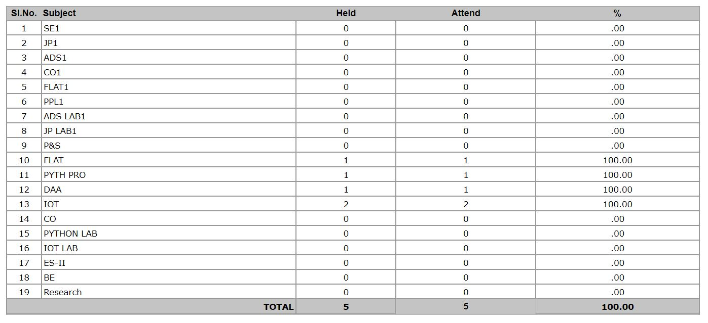
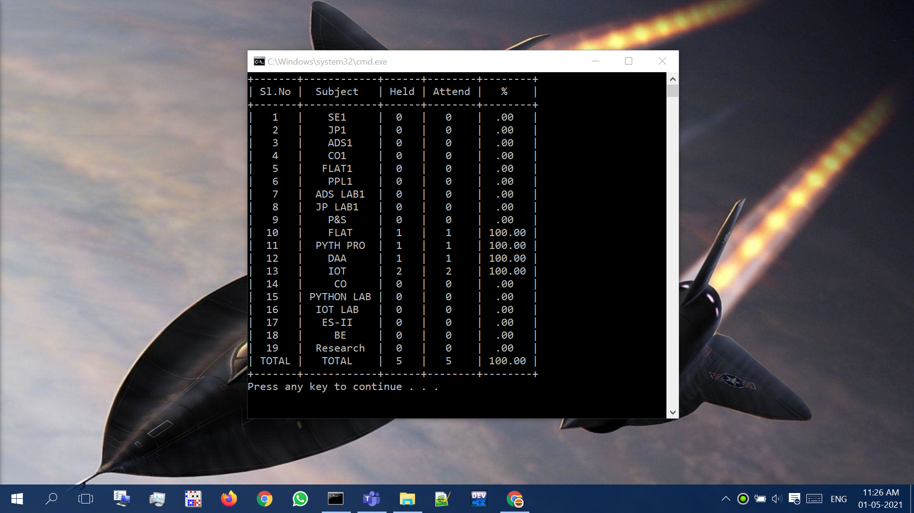

## Daily Attendance Python Bot
**Instructions:**

- You must have Python installed in your PC
- Required Libraries: Selenium, Pandas, BeautifulSoup, Tabulate.
-  Download <a href="https://chromedriver.chromium.org/downloadschromedriver">chromedriver</a>
- Add it in the same directory where test1.py is located
- Replace the ---UID---, ---PWD--- placeholders with your Username and Password
- Run it using Daily Attendance.bat or using Command Prompt
 
---
**Instructions to install required libraries:**

- You must have pip installed. It comes along with Python.
```
pip install selenium
pip install pandas
pip install beautifulsoup4
pip install tabulate
```
#### or
```
pip install -r requirements.txt
```
---
**Configuring Daily Attendance.bat File:**

You have to configure Daily Attendance.bat file before using it.

- Copy the folder path where both test1.py and chromedriver.exe files were located.
- Open Daily Attendance.bat file and replace the ---Path to python folder--- placeholder with copied path.
- Now you are good to go!
- You can copy the Daily Attendance.bat to anywhere on your computer and can instantly invoke the script.
### Follow the below video.
[](https://youtu.be/jabMz1B6AOc)

---
**Useful Links:**

- <a href="https://www.programiz.com/python-programming/datetime/current-datetime">Getting Current Date in Python</a>
- <a href="https://stackoverflow.com/questions/42743702/how-to-click-select-radio-button-with-python-selenium#:~:text=You%20should%20switch%20to%20iframe%20before%20handling%20radio-button%3A">Clicking on a Radio Button</a>
- <a href="https://www.tutorialspoint.com/html/html_iframes.htm#:~:text=The%20tag%20defines%20a,within%20the%20current%20HTML%20document.">HTML -  iframes</a>
- <a href="https://medium.com/analytics-vidhya/scraping-tables-from-a-javascript-webpage-using-selenium-beautifulsoup-and-pandas-cbd305ca75fe">Scrapping tables using BeautifulSoup, Selenium and Pandas</a>
- <a href="https://selenium-python.readthedocs.io/waits.html">Explicit Waits in Selenium</a>
- <a href="https://stackoverflow.com/questions/5041008/how-to-find-elements-by-class">Find elements by class in BeautifulSoup</a> 
- <a href="https://stackoverflow.com/questions/18528533/pretty-printing-a-pandas-dataframe#:~:text=I%27ve%20just%20found%20a%20great%20tool%20for%20that%20need%2C%20it%20is%20called%20tabulate.">Pretty Printing a Pandas Dataframe</a>
- <a href="https://pypi.org/project/tabulate/">Tabulate module in Python</a>
- <a href="https://www.tutorialspoint.com/how-to-handle-frames-in-selenium-with-python">Handling HTML frames using Selenium</a>
- <a href="https://stackoverflow.com/questions/11065421/command-prompt-wont-change-directory-to-another-drive#:~:text=you%20can%20use%20/d-,cd%20/d%20d%3A%5CDocs%5CJava,-For%20more%20help">Directory switching to other Drive using CMD</a>
- <a href="https://medium.com/@andikarachman/pandas-tutorial-modifying-dataframes-e30cdf208f92">Modifying Dataframes</a>
- <a href="https://stackoverflow.com/questions/8688846/resize-command-prompt-through-commands#:~:text=command%20prompt%2C%20eg.-,mode%20con%3Acols%3D80%20lines%3D100,-will%20make%20the">Resizing Batch Script window</a>
- <a href="https://www.tutorialspoint.com/batch_script/batch_script_title.htm">Adding title to Batch Script</a>
---
**Output Screenshots:**



---

### Output Video:

[](https://youtu.be/jppqAZgaF8I)
